# 3.1.3 Sơ đồ Use case

Sơ đồ Use case mô tả quan hệ giữa **actor** (người/thực thể tương tác với hệ thống) và các **chức năng (use case)** mà hệ thống cung cấp. Nội dung dưới đây phản ánh **phiên bản hiện tại** của dự án (React + ASP.NET Core API, phân quyền JWT, luồng khách chưa đăng nhập, OTP đăng ký Tenant).

**File draw.io (diagrams.net):** mở bằng [diagrams.net](https://app.diagrams.net/) hoặc VS Code (Draw.io Integration): [`BaoCao-3.1.3-SoDo-Usecase.drawio`](./BaoCao-3.1.3-SoDo-Usecase.drawio).

**Ký hiệu UML (đã chỉnh trong file .drawio):** ranh giới hệ thống kiểu **«subsystem»**; **tác nhân** (`umlActor`); **use case** = **ellipse**; liên kết tác nhân–use case = **đường liền không mũi tên**; **«include»** / **«extend»** = **phụ thuộc nét đứt, mũi tên mở** (`openThin`) hướng tới use case được gồm / use case cơ sở.

**Sơ đồ ERD (Crow’s Foot / IE):** [`BaoCao-ERD-MoiKetHop.drawio`](./BaoCao-ERD-MoiKetHop.drawio) — bảng có **tiêu đề xanh**, cột **PK** / **FK**, mỗi dòng một thuộc tính + kiểu; đường nối **góc vuông** với ký hiệu **ER** (`ERone`, `ERmany`, `ERzeroToOne`); **OtpCode** khung **nét đứt**, cạnh **User** chỉ là liên kết logic (cùng email, không FK).

**Mô hình CDM** (kiểu **PowerDesigner** — thực thể + ô «relationship» + bản số `0,1` / `1,1` / `1,n`): [`BaoCao-CDM-MoiKetHop.drawio`](./BaoCao-CDM-MoiKetHop.drawio). Trên sơ đồ: ký hiệu **pi** (primary identifier) và **M** (mandatory); đường nối **không** Crow’s foot (chi tiết bảng ở ERD).

**CDM bằng PlantUML** (thực thể tiếng Việt, kiểu khái niệm, quan hệ có tên nghiệp vụ + `note on link`): [`BaoCao-CDM-MoiKetHop.puml`](./BaoCao-CDM-MoiKetHop.puml).

**Mô hình PDM** (bảng tiếng Anh + tên tiếng Việt trong ngoặc, cột gắn nhãn pk/fk, kiểu SQL Server, đường có mũi tên về phía bảng con): [`BaoCao-PDM-MoiKetHop.drawio`](./BaoCao-PDM-MoiKetHop.drawio) — khớp snapshot EF Core hiện tại.

**PDM bằng PlantUML** (cột đầy đủ theo snapshot, nhãn FK trên cạnh): [`BaoCao-PDM-MoiKetHop.puml`](./BaoCao-PDM-MoiKetHop.puml).

**Sơ đồ kết hợp thực thể (PlantUML):** [`BaoCao-KetHopThucThe.puml`](./BaoCao-KetHopThucThe.puml) — mô hình IE/ER (`entity`, quan hệ `||--o|`, `||--o{`). Xem nhanh: [PlantUML Web Server](https://www.plantuml.com/plantuml/uml) (dán nội dung file) hoặc extension **PlantUML** trong VS Code.

**Bộ sơ đồ Sequence (PlantUML) cho các chức năng chính:** [`BaoCao-SEQ-MucLuc.md`](./BaoCao-SEQ-MucLuc.md).

---

## Các Actor của hệ thống

**Bảng 1: Bảng Actor**

| Actor | Ý nghĩa |
|--------|---------|
| **Khách vãng lai (Guest)** | Người dùng **chưa đăng nhập**, được phép xem một số nội dung công khai (trang chủ/dashboard khách, phòng trống, điều khoản thuê trọ). |
| **Landlord** | Chủ trọ — tài khoản có vai trò quản trị vận hành khu trọ (tạo trong DB hoặc quy trình riêng; **không** qua luồng đăng ký OTP công khai như người thuê). |
| **Tenant** | Khách thuê — tài khoản thường được tạo qua **Đăng ký + xác thực OTP email** (hệ thống gán role Tenant). |

---

## Các Use case

**Bảng 2: Bảng Use case**

| Use case | Ý nghĩa |
|----------|---------|
| **Đăng nhập** | Đăng nhập vào tài khoản, nhận JWT. |
| **Đăng ký (Tenant)** | Gửi thông tin đăng ký; hệ thống gửi OTP qua email (tài khoản Tenant được tạo sau bước xác thực OTP kèm đủ thông tin). |
| **Xác thực OTP** | Xác nhận mã OTP (đăng ký / quên mật khẩu tùy luồng). |
| **Gửi lại OTP** | Yêu cầu gửi lại mã OTP. |
| **Xem thông tin tài khoản hiện tại (me)** | Lấy thông tin user đang đăng nhập. |
| **Quên mật khẩu** | Yêu cầu gửi OTP để đặt lại mật khẩu. |
| **Đặt lại mật khẩu** | Đổi mật khẩu sau khi xác thực OTP (quên mật khẩu). |
| **Đổi mật khẩu** | Đổi mật khẩu khi đã đăng nhập. |
| **Đăng xuất** | Kết thúc phiên (phía client xóa token; server có endpoint logout). |
| **Xem dashboard công khai** | Khách chưa đăng nhập xem trang giới thiệu/lối tắt (trang chủ khách). |
| **Xem điều khoản thuê trọ** | Đọc nội dung điều khoản (có thể truy cập khi chưa đăng nhập). |
| **Xem danh sách phòng (Landlord)** | Chủ trọ xem toàn bộ phòng trong hệ thống. |
| **Xem phòng trống (công khai / Tenant)** | Xem danh sách phòng trạng thái còn trống (API cho phép truy cập không cần đăng nhập). |
| **Xem chi tiết phòng** | Xem thông tin một phòng (số phòng, diện tích, giá, ảnh, cọc, thời hạn thuê tối thiểu, …). |
| **Thêm phòng** | Chủ trọ tạo phòng mới (upload ảnh, cấu hình giá, cọc, thời hạn thuê tối thiểu). |
| **Cập nhật phòng** | Chủ trọ sửa thông tin phòng. |
| **Xóa phòng** | Chủ trọ xóa phòng. |
| **Yêu cầu thuê phòng** | Khách thuê gửi yêu cầu thuê (tạo hợp đồng ở trạng thái chờ xử lý; có thể kèm xác nhận điều khoản theo luồng ứng dụng). |
| **Xem danh sách khách thuê** | Chủ trọ xem danh sách người thuê. |
| **Xem chi tiết khách thuê** | Chủ trọ xem hồ sơ một người thuê. |
| **Cập nhật khách thuê (Landlord)** | Chủ trọ cập nhật thông tin người thuê trên hệ thống. |
| **Xem hồ sơ cá nhân (Tenant)** | Khách thuê xem thông tin hồ sơ của mình. |
| **Cập nhật hồ sơ cá nhân (Tenant)** | Khách thuê cập nhật thông tin cá nhân. |
| **Xem phòng đang thuê** | Khách thuê xem thông tin phòng hiện đang gắn với mình. |
| **Xem danh sách hợp đồng** | Chủ trọ xem hợp đồng (có thể lọc theo trạng thái qua các API danh sách). |
| **Xem hợp đồng chờ duyệt** | Chủ trọ xem hợp đồng chờ duyệt. |
| **Xem hợp đồng chờ thanh toán cọc** | Chủ trọ xem hợp đồng đang chờ khách đóng cọc (luồng cọc). |
| **Xem hợp đồng đang hoạt động** | Chủ trọ xem hợp đồng đang có hiệu lực. |
| **Xem hợp đồng sắp hết hạn** | Chủ trọ xem hợp đồng gần đến hạn (theo tham số ngày). |
| **Xem chi tiết hợp đồng** | Xem thông tin một hợp đồng. |
| **Tạo hợp đồng (Landlord)** | Chủ trọ tạo hợp đồng (phòng, khách, thời hạn, cọc, …). |
| **Duyệt hợp đồng** | Chủ trọ phê duyệt hợp đồng chờ duyệt. |
| **Từ chối hợp đồng** | Chủ trọ từ chối hợp đồng chờ duyệt. |
| **Cập nhật hợp đồng** | Chủ trọ sửa thông tin hợp đồng. |
| **Gia hạn hợp đồng** | Chủ trọ gia hạn thời hạn hợp đồng. |
| **Chấm dứt hợp đồng (Landlord)** | Chủ trọ thực hiện chấm dứt hợp đồng theo nghiệp vụ. |
| **Yêu cầu chấm dứt hợp đồng (Tenant)** | Khách thuê gửi yêu cầu chấm dứt (endpoint riêng cho Tenant). |
| **Ghi nhận hoàn cọc** | Chủ trọ ghi nhận hoàn cọc cho khách (số tiền, thời điểm, ghi chú). |
| **Xóa hợp đồng** | Chủ trọ xóa hợp đồng. |
| **Xuất PDF hợp đồng** | Tải/xem file PDF hợp đồng (API server; giao diện có thể xuất nhanh phía client). |
| **Xem hợp đồng của tôi** | Khách thuê xem hợp đồng của mình. |
| **Xem danh sách hóa đơn** | Chủ trọ xem danh sách hóa đơn. |
| **Xem hóa đơn chờ thanh toán** | Chủ trọ xem hóa đơn chưa thanh toán / cần xử lý. |
| **Tạo hóa đơn tháng** | Chủ trọ sinh hóa đơn theo hợp đồng và kỳ (tiền phòng, điện, nước, phí dịch vụ suy từ chỉ số và tổng). |
| **Tạo hóa đơn cọc** | Chủ trọ tạo hóa đơn loại cọc (luồng cọc). |
| **Cập nhật hóa đơn** | Chủ trọ chỉnh sửa hóa đơn. |
| **Xóa hóa đơn** | Chủ trọ xóa hóa đơn. |
| **Đánh dấu đã thanh toán** | Chủ trọ cập nhật trạng thái thanh toán hóa đơn. |
| **Xem hóa đơn theo hợp đồng** | Xem các hóa đơn thuộc một hợp đồng. |
| **Xem chi tiết hóa đơn** | Xem một hóa đơn. |
| **Xuất PDF hóa đơn** | Tải/xem file PDF hóa đơn (API server; giao diện có thể xuất nhanh phía client). |
| **Xem hóa đơn của tôi** | Khách thuê xem hóa đơn của mình. |
| **Xem danh sách chỉ số điện nước** | Chủ trọ xem các bản ghi chỉ số. |
| **Xem chỉ số theo phòng** | Chủ trọ xem chỉ số điện/nước (và đơn giá, phí dịch vụ) theo phòng. |
| **Thêm chỉ số điện nước** | Chủ trọ ghi nhận chỉ số mới theo kỳ (kèm đơn giá, phí dịch vụ nếu có). |
| **Cập nhật chỉ số điện nước** | Chủ trọ sửa bản ghi chỉ số. |
| **Xóa chỉ số điện nước** | Chủ trọ xóa bản ghi chỉ số. |
| **Xem báo cáo tổng quan** | Chủ trọ xem số liệu/biểu đồ tổng quan (API báo cáo). |
| **Xem dashboard (theo vai trò)** | Sau đăng nhập: trang chủ hiển thị lối tắt theo Landlord hoặc Tenant. |
| **Xem / sửa thông tin cá nhân (Profile)** | Xem và cập nhật thông tin tài khoản người dùng đã đăng nhập. |
| **Truy cập trang yêu cầu đăng nhập** | Khi khách cố truy cập chức năng cần xác thực, hệ thống chuyển tới đăng nhập kèm thông báo (và có thể quay lại trang đích sau khi đăng nhập). |

---

## Các mối liên hệ Actor – Use case

**Bảng 3: Bảng các mối liên hệ trong sơ đồ**

| Actor | Use case chính |
|--------|----------------|
| **Khách vãng lai** | Xem dashboard công khai; Xem phòng trống; Xem điều khoản thuê trọ; Xem chi tiết phòng (theo luồng cho phép); Đăng nhập; Đăng ký (Tenant); Quên mật khẩu; Gửi lại OTP; Truy cập trang yêu cầu đăng nhập (khi vào chức năng hạn chế). |
| **Chủ trọ (Landlord)** | Đăng nhập; Quên mật khẩu; Đặt lại mật khẩu; Đổi mật khẩu; Đăng xuất; Xem thông tin tài khoản (me); Xem dashboard; Xem / sửa Profile; Quản lý phòng (danh sách, chi tiết, thêm/sửa/xóa); Quản lý khách thuê; Quản lý hợp đồng (danh sách theo trạng thái, tạo, duyệt, từ chối, sửa, gia hạn, chấm dứt, hoàn cọc, xóa, PDF); Quản lý hóa đơn (danh sách, chờ thanh toán, tạo tháng/cọc, sửa, xóa, thanh toán, PDF); Quản lý chỉ số điện nước (theo phòng, CRUD); Xem báo cáo tổng quan. |
| **Khách thuê (Tenant)** | Đăng ký (OTP); Xác thực OTP; Gửi lại OTP; Đăng nhập; Quên mật khẩu; Đặt lại mật khẩu; Đổi mật khẩu; Đăng xuất; Xem thông tin tài khoản (me); Xem dashboard; Xem / sửa Profile; Xem phòng trống; Xem chi tiết phòng; Yêu cầu thuê phòng; Xem hồ sơ / cập nhật hồ sơ; Xem phòng đang thuê; Xem hợp đồng của tôi; Yêu cầu chấm dứt hợp đồng; Xem hóa đơn của tôi. |

---

## Gợi ý vẽ sơ đồ (Mermaid – tham khảo khi nhúng vào báo cáo)

```mermaid
flowchart TB
  subgraph KhachVangLai["Khách vãng lai"]
    G1[Xem dashboard công khai]
    G2[Xem phòng trống]
    G3[Xem điều khoản]
    G4[Đăng nhập / Đăng ký]
  end

  subgraph ChuTro["Chủ trọ (Landlord)"]
    L1[Quản lý phòng]
    L2[Quản lý khách thuê]
    L3[Quản lý hợp đồng]
    L4[Quản lý hóa đơn]
    L5[Quản lý chỉ số điện nước]
    L6[Báo cáo]
    L7[Tài khoản / Profile]
  end

  subgraph KhachThue["Khách thuê (Tenant)"]
    T1[Xem phòng / Yêu cầu thuê]
    T2[Hợp đồng của tôi]
    T3[Hóa đơn của tôi]
    T4[Hồ sơ / Profile]
    T5[OTP / Mật khẩu]
  end

  UC[(Hệ thống Quản lý phòng trọ)]
  G1 & G2 & G3 & G4 --> UC
  L1 & L2 & L3 & L4 & L5 & L6 & L7 --> UC
  T1 & T2 & T3 & T4 & T5 --> UC
```

> **Lưu ý khi trình bày báo cáo:** Trong Word/PDF có thể vẽ lại sơ đồ Use case chuẩn UML (oval + actor stick figure); bảng trên dùng để liệt kê đầy đủ use case khớp mã nguồn hiện tại. Tài khoản **Chủ trọ** trong triển khai thực tế thường được **tạo sẵn trong CSDL** (không qua form đăng ký công khai dành cho Tenant).
